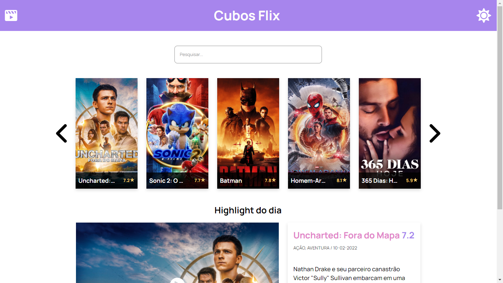
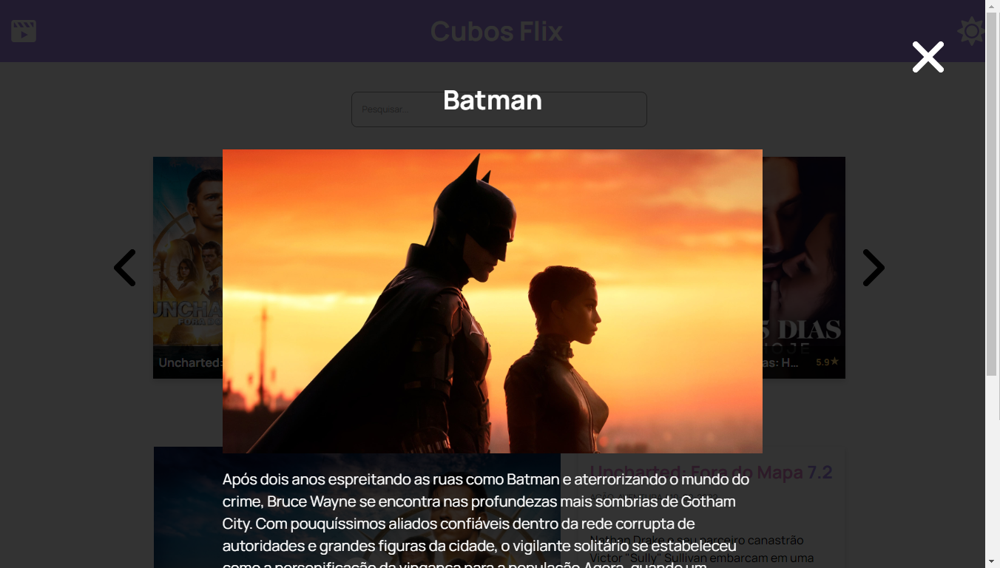
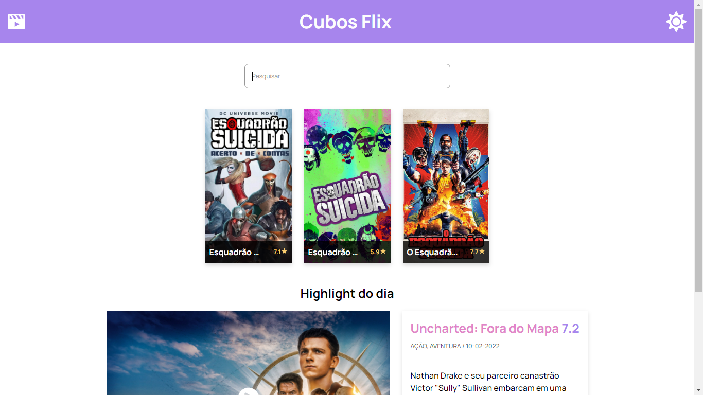

# Cubos flix
Site made for the second challenge of Cubos Academy's FullStack software development course. In the construction process, only HTML, CSS and Javascript were used.

This website, show you the 20 most watched movies of the day in the homepage, and you can search for any movie to see his infos. In the end of the page, it has the highlight movie of the day.

## Link to see the project working

- https://victorvinicius33.github.io/cubos-flix/

## Project Images
 

## How to use

- You can use the search bar to search for a movie.
- if you search an empty text, it will come back to the 20 top movies of the day.
- When you click in a movie, it will show a poster with the description, genres and the movie score.
- If you click in the highlight movie image, it will redirect you to a new browser tab in youtube to see the movie trailer.

## Author

| [ Victor Vinícius da Silva Galvão](https://github.com/victorvinicius33) 
| :---: |

 

